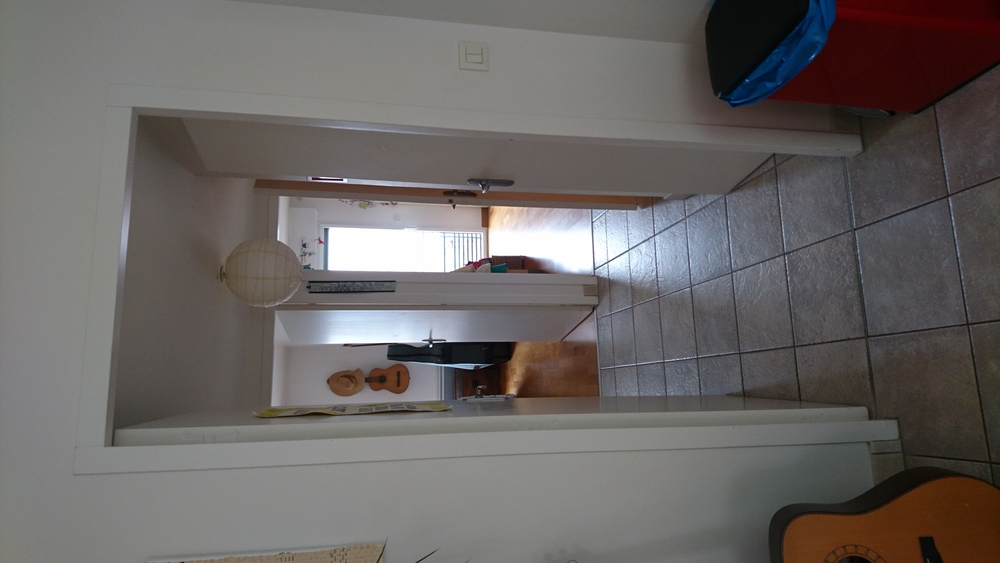
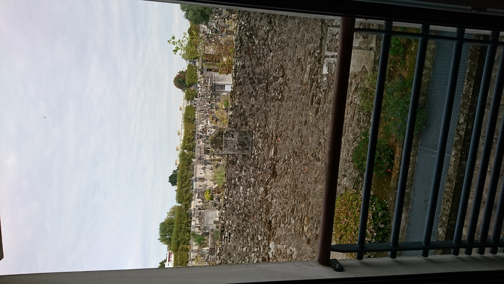
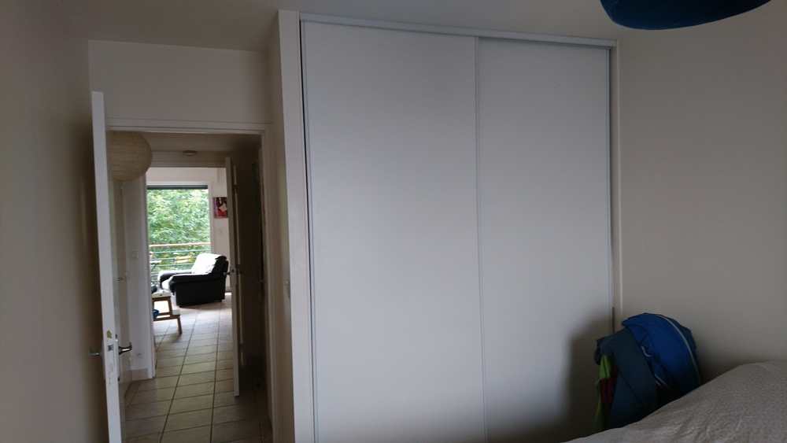
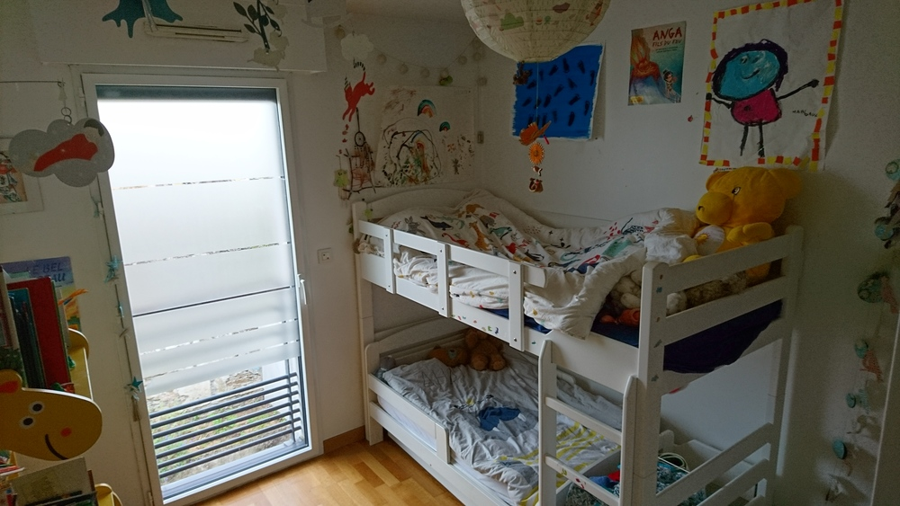
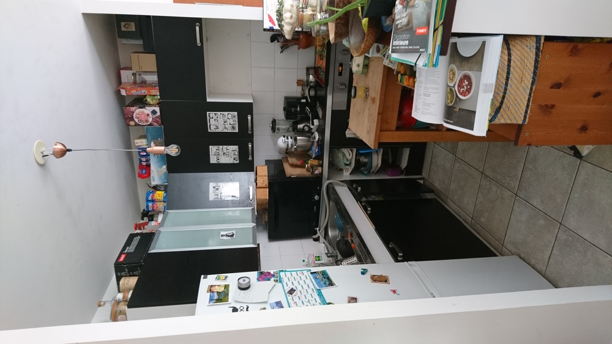
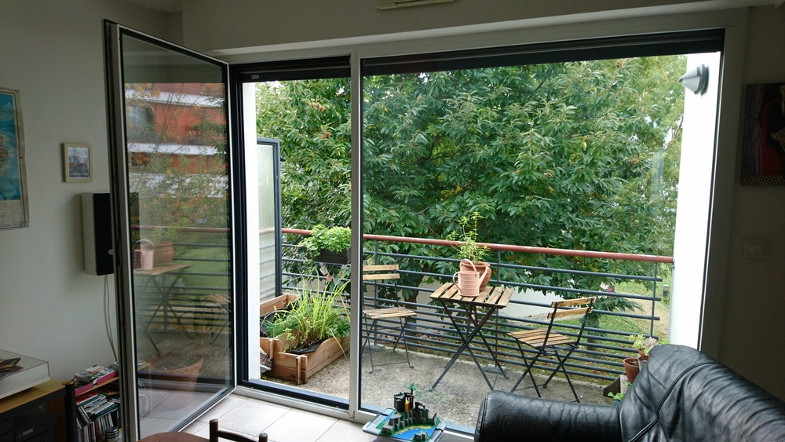
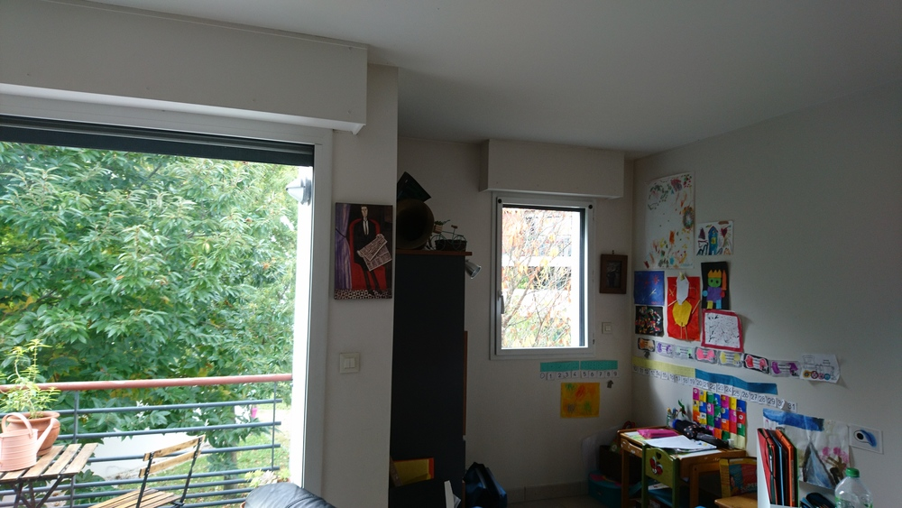

# Rue Frédéric cailliaud

[rue Frédéric Cailliaud](https://www.google.fr/maps/@47.2200732,-1.5412229,68a,35y,39.58t/data=!3m1!1e3)

[annonce Le bon coin](https://www.leboncoin.fr/ventes_immobilieres/1850015894.htm)

## Impressions d'ensemble

Il est dans la même résidence que celle où j'habite.
Proche du T1, de la gare, du Jardin des plantes.

La résidence date de 2007.
L'appartement est situé dans le "pavillon", immeuble de 1 étage situé à l'intérieur de la résidence, c'est très calme.
Orientation sud, avec des arbres devant.
Je craignais que le vis à vis soit un problème. mais en fait non, pas vraiment.

Chauffage au sol.

## Entrée

Entrée avec un placard.

## Chambre 1
A une penderie.

Vue depuis le couloir

La vue sur le cimetière, derrière, à l'est.

Vue générale

Le parquet a dû prendre des gouttes d'eau.

La penderie dont les rails réclament un p'tit réglage.

## Chambre 2

même vue sur le cimetière, derrière, à l'est.
Pas de penderie.

Vue générale

## Cuisine

Les meubles sont un peu fatigués. il faudrait peut-être revoir l'aménagement, avec le comptoir.

## Salle de bain

## Séjour

Assez lumineux, je trouve.

## Terrasse

