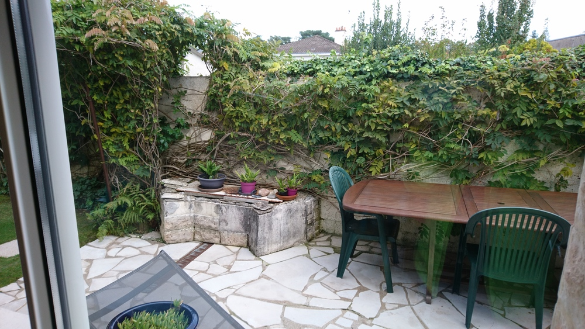
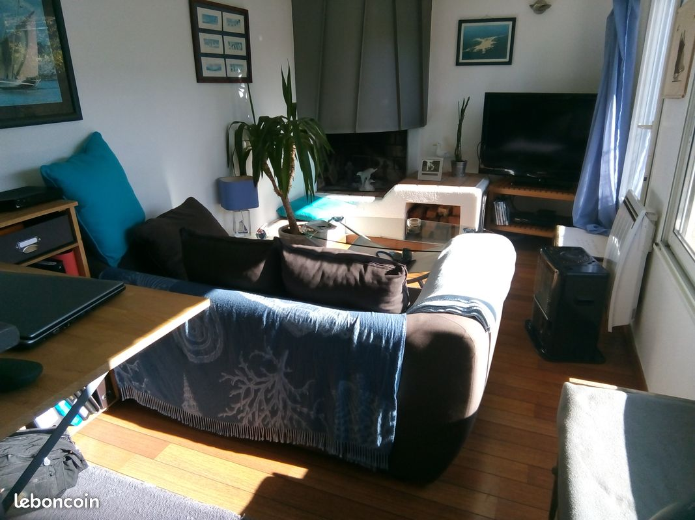
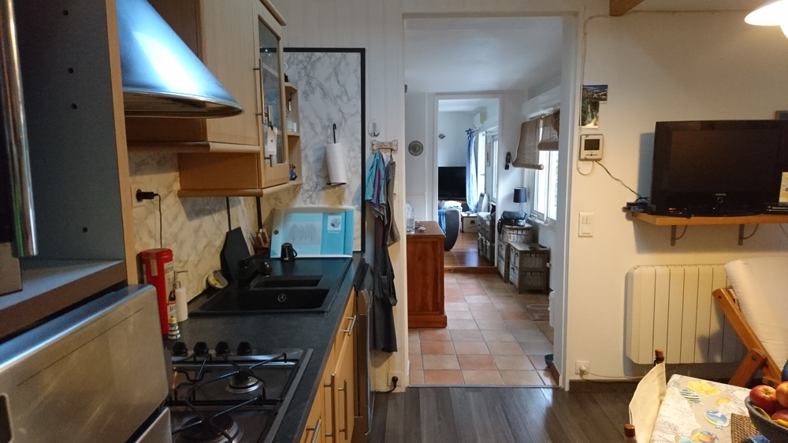
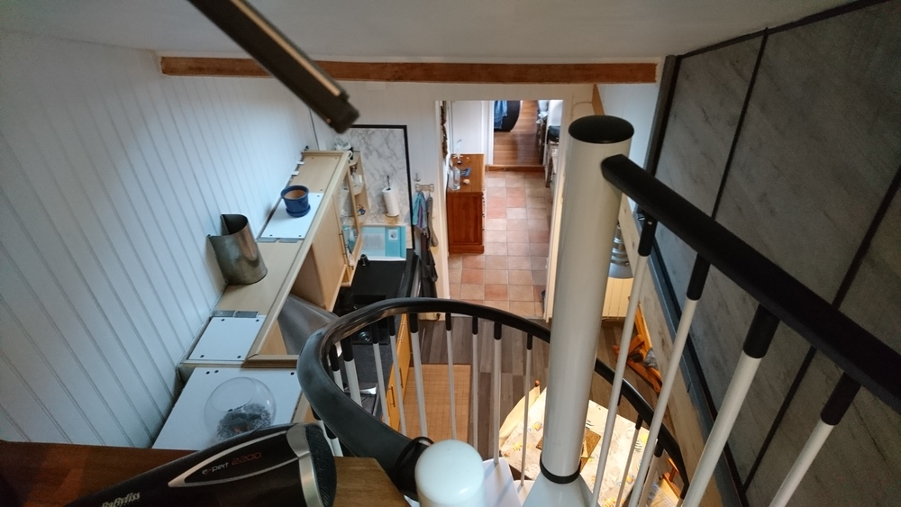
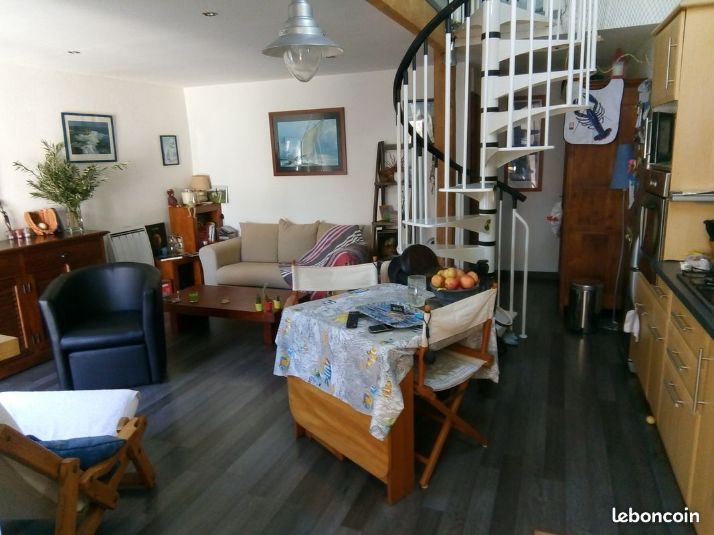
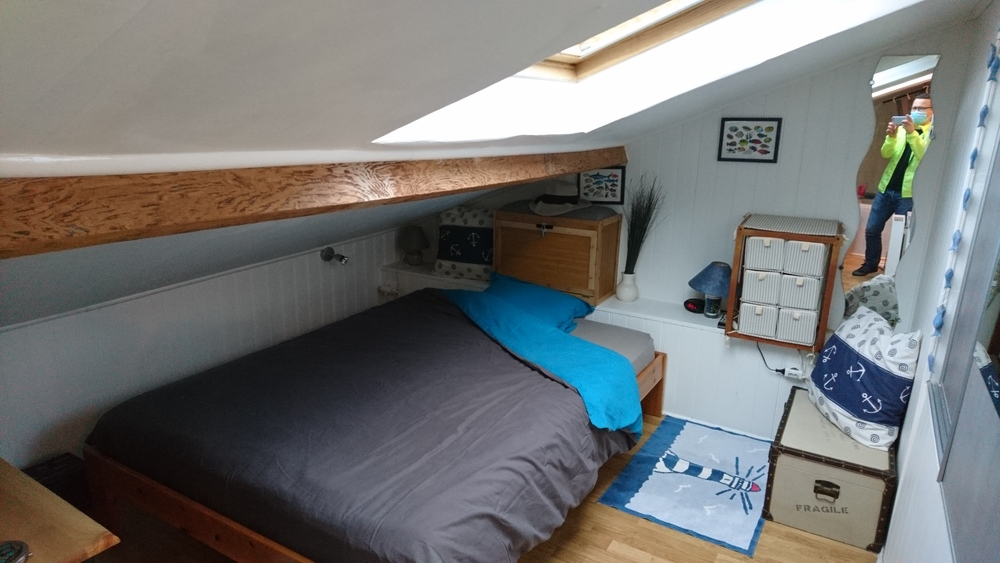
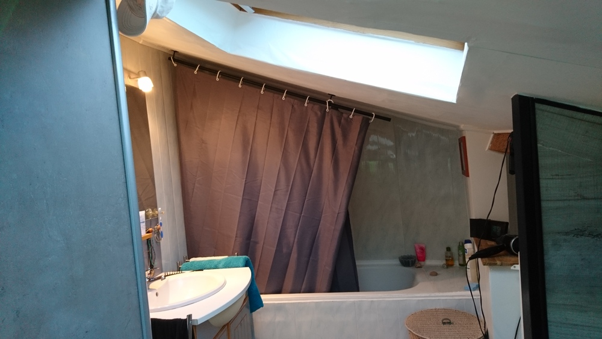

# Maison - parc de la Gaudinière

[15 rue des marguerites, Orvault](https://www.google.fr/maps/place/15+Rue+des+Marguerites,+44700+Orvault/@47.2444338,-1.5840369,60a,35y,39.58t/data=!3m1!1e3!4m5!3m4!1s0x4805edb59fc15e77:0x7316c35b3b523239!8m2!3d47.2448868!4d-1.5839257)

[annonce Le bon coin](https://www.leboncoin.fr/ventes_immobilieres/1852092289.htm/)

## Impressions d'ensemble

3 mots pour qualifer cette maison:

 - cocon
 - charme désuet
 - lumière

La maison date des années 30/40.

Taxe foncière: 550 euros

Consommation électrique: 900 euros/an (nb: je n'ai pas regardé la tête des radiateurs, mais une des photos du séjour donne à penser qu'ils sont récents)

Le terrain est tout en longueur, franchement moins large que long, mais on ne ressent aucune oppression.
Je me suis senti en sécurité. Il y a une maison qui donne sur la terrasse, mais la vue est coupée par le mur de séparation.

En entrant sur le terrain:

 - une pelouse avec des arbres
 - un chemin de pierres plates menant à la terrasse
 - une terrasse réalisée en pierres plates du même type que les susdites pierres plates du chemin

La maison est en "L" avec, en avançant depuis le jardin vers le fond de la maison:

- un abri en bois d'arbre de 10m2
- un bureau avec cheminée (mais pas d'insert) grosso modo 15m2 (au pifomètre)
- cabinet d'aisance propre (désuet vous dis-je)
- l'entrée
- séjour/cuisine 24m2
- sdb/chambre en haut (pas de séparation entre les deux)

Un couloir relie le bureau, la porte d'entrée, le cabinet d'aisance et la cuisine.

## Transport / commerces

## Extérieur

Pour entrer depuis la rue dans le jardin:
 
  - portail électrique
  - porte attenante au susdit portail avec visiophone.

La proprio gare sa voiture dans le jardin.

Le jardin est trop choupinet. pelouse rase impeccablement tondue.

Le jardin vue depuis la terrasse.

La terrasse vue depuis le bureau.

La terrasse vue depuis le couloir.

## Bureau

Le bureau servait de chambre lorsque la proprio acheta la maison.
La cheminée sert plutôt d'agrément. Coût du ramonage annuel: 50 euros.

Il est assez lumineux car il donne sur le sud, il a sa propre fenêtre et est également éclairé par la fenêtre dans le couloir.

## Couloir

Lumineux, éclairant le bureau et la cuisine/séjour.

## Cuisine

Fonctionnelle, avec un évier dont les dimensions forcent le respect.

La proprio laisse le frigo, le four, la hotte, la gazinière. Il ne s'agit pas du gaz de ville, mais de bouteille de gaz.
Elle a pensé mettre une plaque à induction, mais comme elle cuisine peu, elle a changé d'avis.

Honnêtement, je me demande ce qu'il en est de l'installation électrique et si elle supporterait une plaque à induction.
Je n'ai pas demandé où se trouve le boîtier électrique et si le circuit est aux normes.

Si on regarde bien la hotte, elle rejette l'air (filtré) dans la pièce (ceci dit, c'est pareil dans mon appartement).
Je suis étonné par la propreté des meubles au dessus de la cuisine, pas de poussière, pas de gras (elle cuisinerait peu).

# séjour

Agréable, cosy, orienté à l'est. 
La photo est prise le 5 octobre, le soir, ciel gris, mais malgré tout il est assez lumineux: il y a un velux au niveau de la cuisine en sus de la baie vitrée.

Il contient un escalier en spirale, et derrière cet escalier un espace dans lequel la proprio y a placé une armoire. Un petit débarras situé en face de l'armoire contient un cumulus de 150 litres (plutôt adapté pour 2/3 personnes).

# Etage: chambre et salle de bain

Sous la toiture se trouvent la chambre (avec placard) et une baignoire ainsi qu'un évier situé en face de l'escalier.
On a donc un espace ouvert regroupant chambre et salle de bain.

La lumière provient de deux velux: un pour la chambre, un pour l'évier/baignoire/escalier.

La proprio me dit que le toit est bien isolé: 5 cm de polyuréthane + 20 cm laine de roche.
La toiture est propre, et semble saine.
La jonction entre les deux toits de deux branches du L a été refaite récemment.
