# appartement Saint Jo.

[12 rue de la planche à gué](https://www.google.fr/maps/place/12+Rue+de+la+Planche+au+Gu%C3%A9,+44300+Nantes/@47.2692248,-1.5237943,17z/data=!3m1!4b1!4m5!3m4!1s0x4805ee3331443f81:0xd571b477b771b913!8m2!3d47.2692212!4d-1.5216056)

[annonce Le bon coin](https://www.leboncoin.fr/ventes_immobilieres/1846224481.htm/)

## Impressions d'ensemble
Immeuble de 2011, les proprios semblent très soigneux.
Parquet au sol, murs propres, pas de coups, pas de traces (sauf dans la chambre 2).
La proprio peut baisser le prix, mais elle ne souhaite pas le brader (on sent quelle y est très attachée). Son copain souhaite lui en partir pour se rapprocher de son boulot.

Le quatier est vraiment agréable à vivre, calme.
J'ai croisé Pawel (on le voit entrer avec son fils dans le jardin sur une des photos) qui m'a confirmé qu'il s'y plaisait beaucoup.

## Transport
J'ai mis 25 minutes en vélo pour aller chez Talend depuis l'appartement, je pense en mettre un peu plus pour en revenir (à cause des faux plats :) ).
Grosso modo pour aller au bal pop, aux cours, je mettrai 20 minutes.

## Entrée

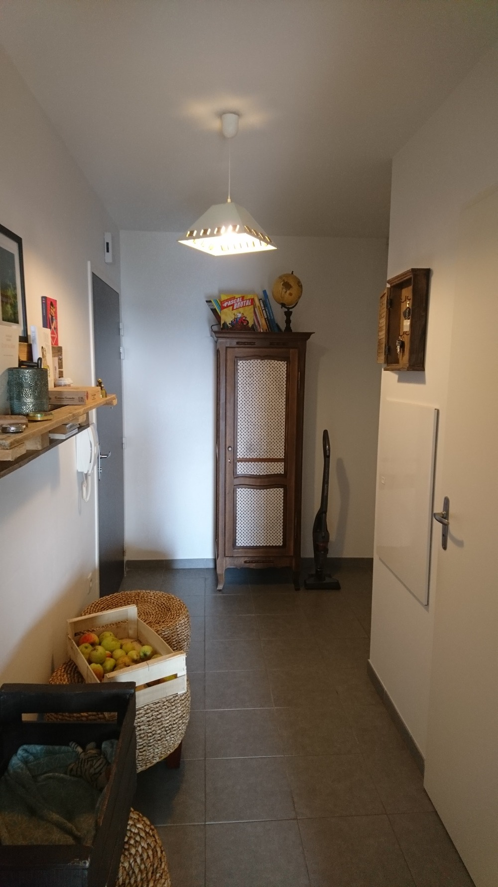

Se trouve un grand placard face à la porte avec une penderie pour une moitié et des étagères pour autre moitié.

## Salon
Dans sa configuration actuelle, je le trouve très accueillant. D'autant plus qu'il recevait la lumière du soir.
Un mur est peint en un magnifique bleu, dont la relative froideur est apaisée par les divers éléments en bois.
Les propriétaires souhaitent laisser quelques éléments de déco, comme les étagères pour les livres. Ce qui me va très bien.

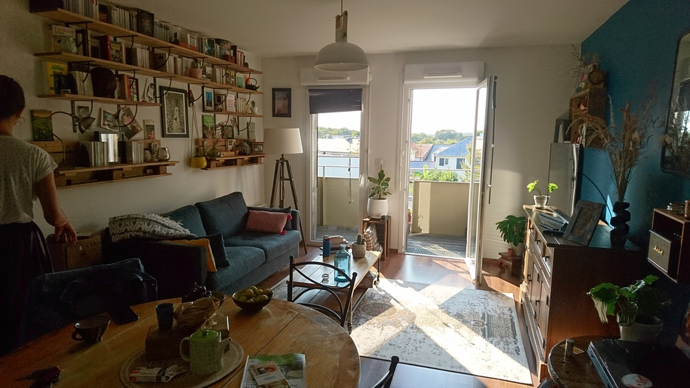
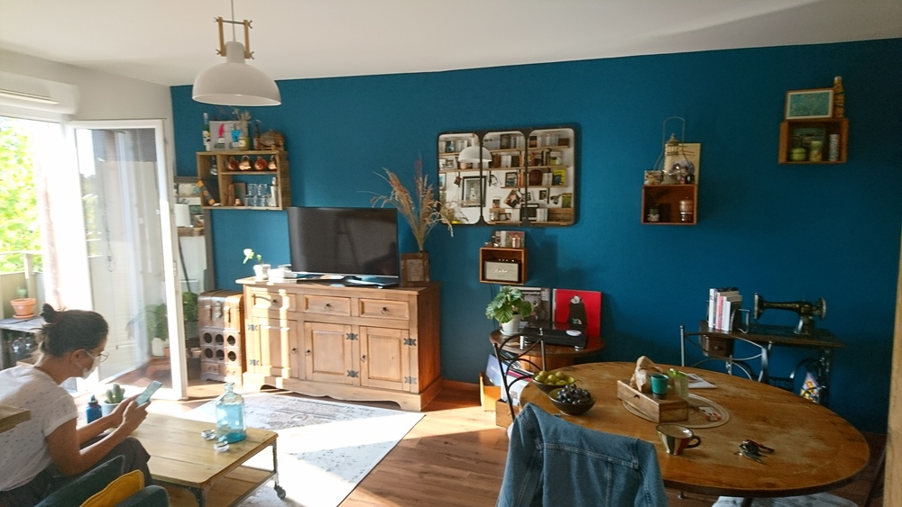

## Balcon
Plutôt petit, on ne peut pas y mettre une table ou alors une toute petite :D.

Il donne sur la crèche derrière et sur l'entrée d'un petit parc, autant dire qu'il n'y a pas de vis à vis.
Les proprios y dînent quelque fois. Toutefois, la plupart du temps, ils profitent des tables et du jardin collectif qui se trouvent à 20 mètres, de l'autre côté de la rue.

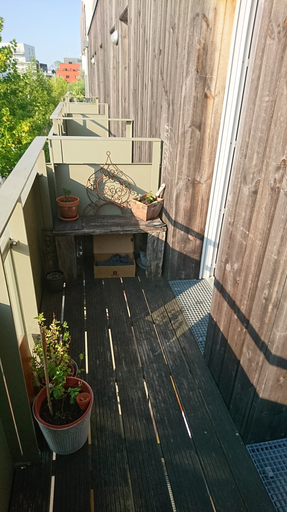
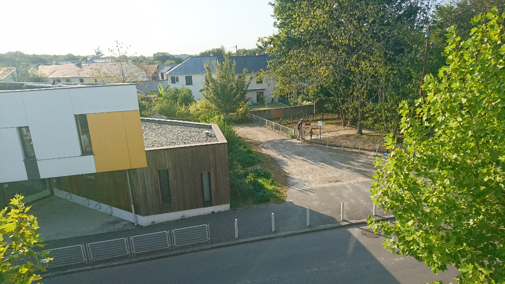

## Salle de bains
Plutôt petite, sans être oppressante.
Petit plus toutefois: une fenêtre qui permet d'évacuer facilement l'humidité.

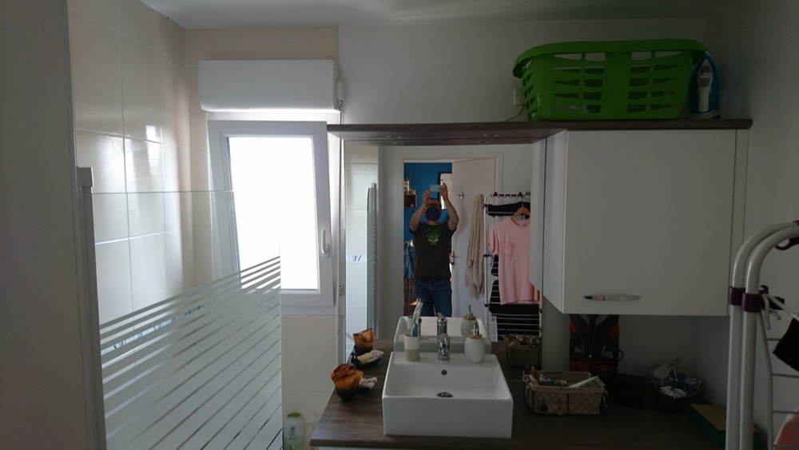
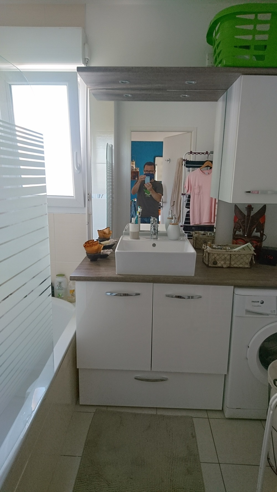

## Chambre 1
13 m2 avec un placard/penderie.
2 fenêtres sur deux pans de murs différents qui apportent de la lumière.

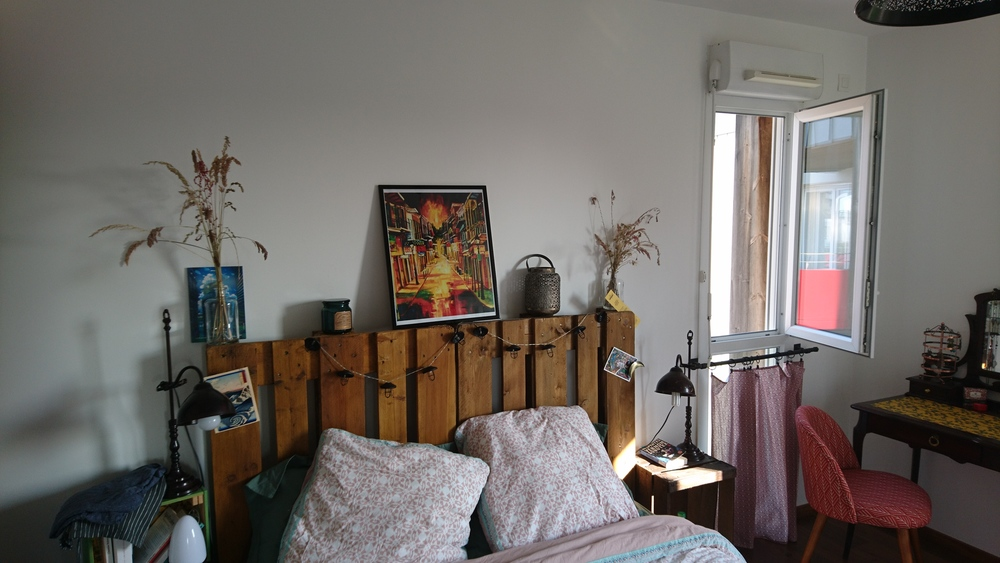
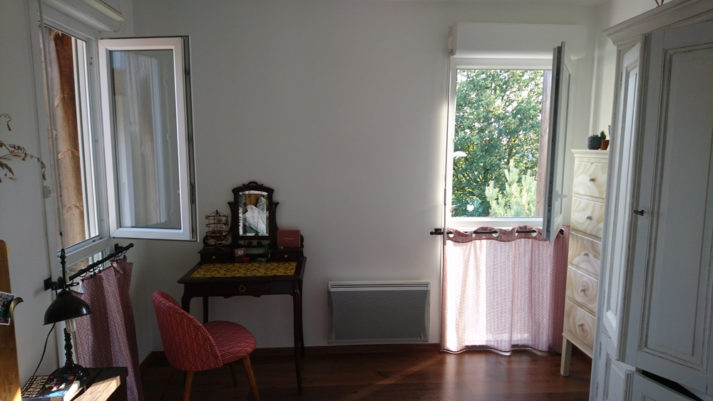
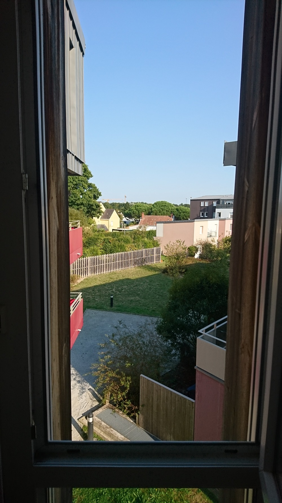

## Chambre 2
Plus petite, de l'ordre de 9/10m2. une fenêtre.
Une marque d'infltration dans la chambre 2. Mais il faut avoir le nez dessus. L'infiltration sera réparée.

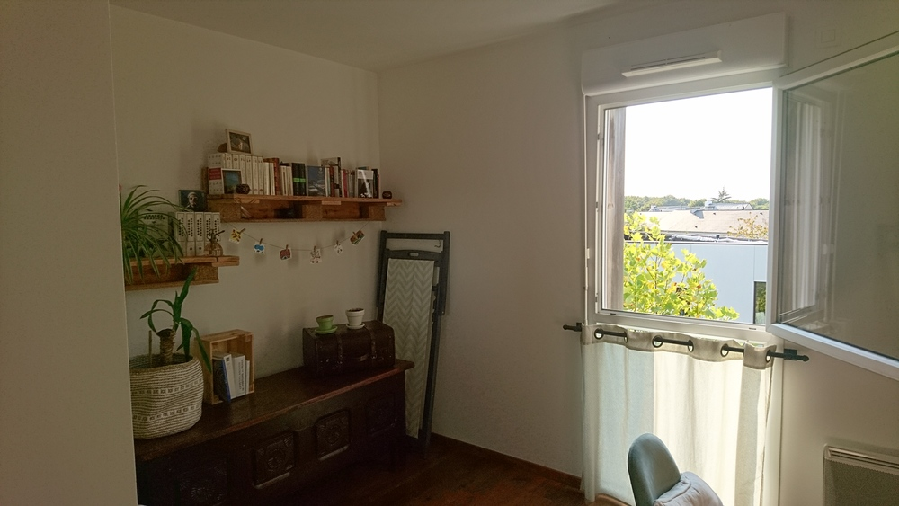
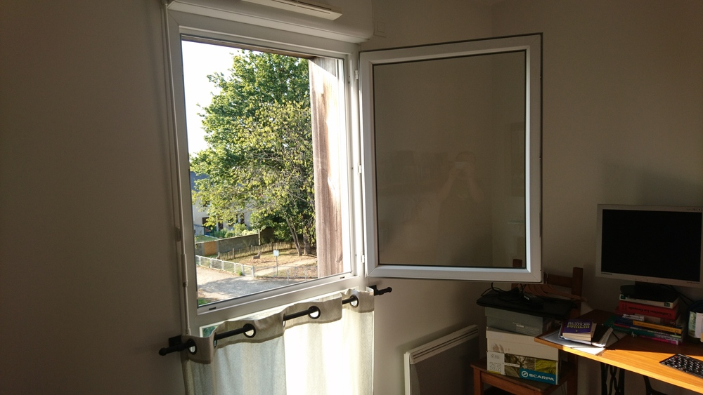

# cuisine
Assez petite, ouverte sur le séjour.
Le lave vaisselle a rendu l'âme, pas grave, je ne m'en servirai pas.

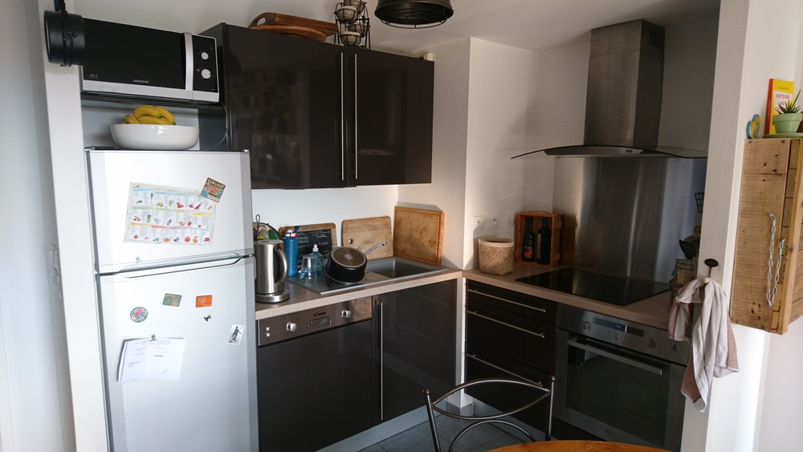
