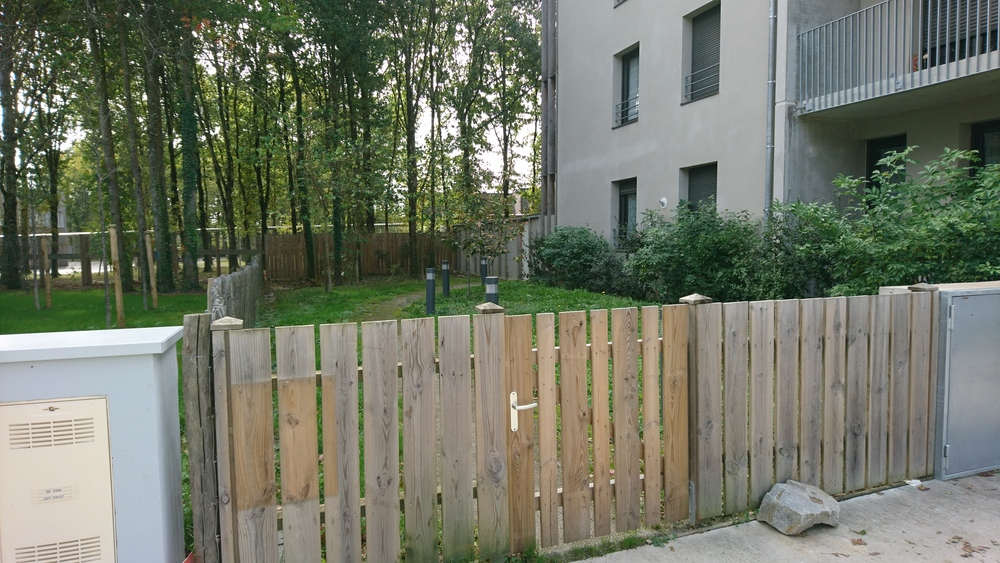
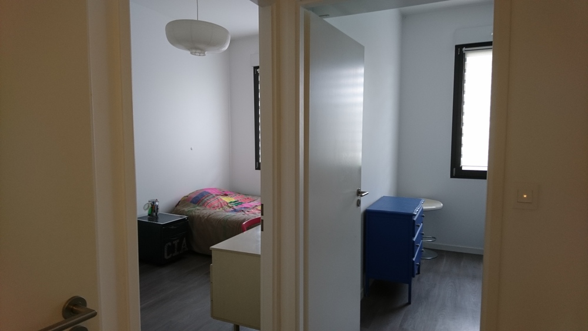
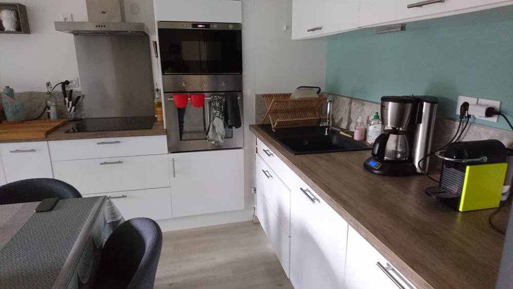
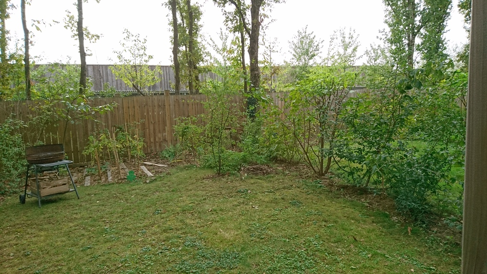
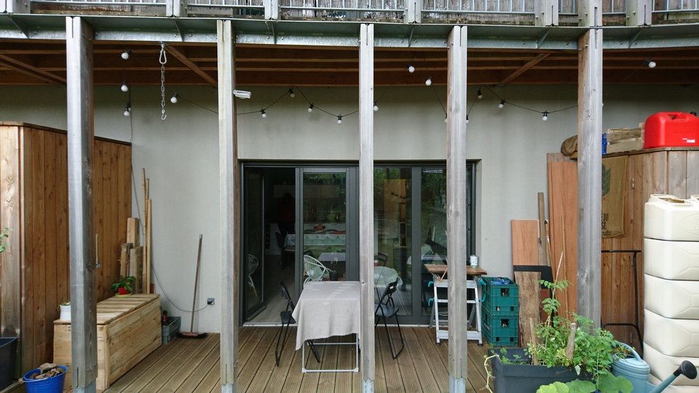
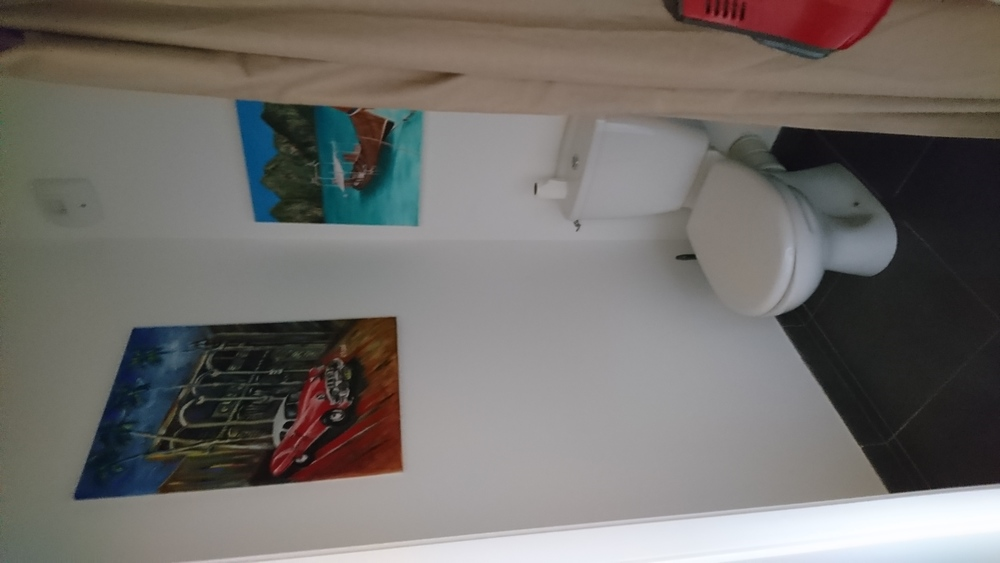
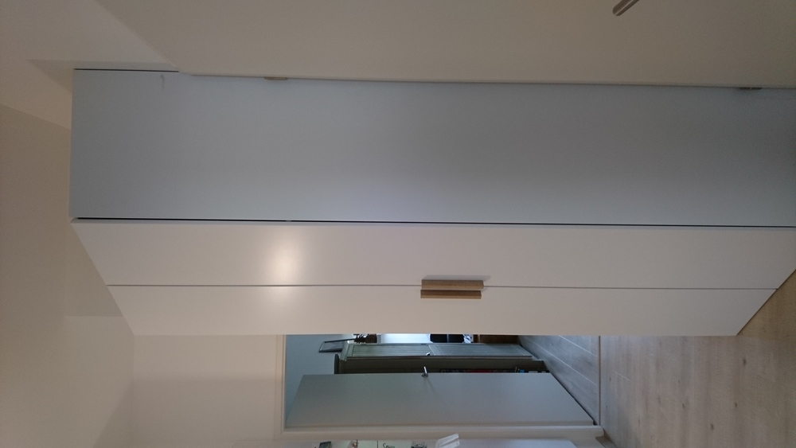

# appartement Saint Jo (C6 station couchant)

[13 rue du port la blanche](https://www.google.fr/maps/place/13+Rue+de+Port+la+Blanche,+44300+Nantes/@47.2713212,-1.5171735,751m/data=!3m2!1e3!4b1!4m5!3m4!1s0x4805efce451062e7:0xcf1772d1ce61010d!8m2!3d47.2713212!4d-1.5149848)

[annonce Le bon coin](https://www.leboncoin.fr/ventes_immobilieres/1855688488.htm)

## Impressions d'ensemble
que du bien. quartier calme.
pas de vis à vis.
Grande hauteur sous plafond (2,9 m) pour rattraper une pente du terrain.

80 euros mensuels de charges de copros.
75 euros mensuels pour électricité.

petit hic: le jardin n'est pas clos pour faciliter la maintenance par le paysagiste.

## Extérieur

Côté rue

Côté jardin, c'est le restaurant du collège. Pas de vis à vis, le bâtiment ne gêne pas le soleil.

## chambres
les deux chambres ont la même surface (11m2) et donne côté rue. Les proprios laissent les penderies.

Les deux chambres vues du couloir.

Chambre 1

Chambre 2

## cuisine/séjour

30 m2

## Jardin
40 m2 terrain + 10m2 terrasse.

## Salle de bain

## Toilettes

# Couloir

Un placard sur mesure laissé par les proprios.

