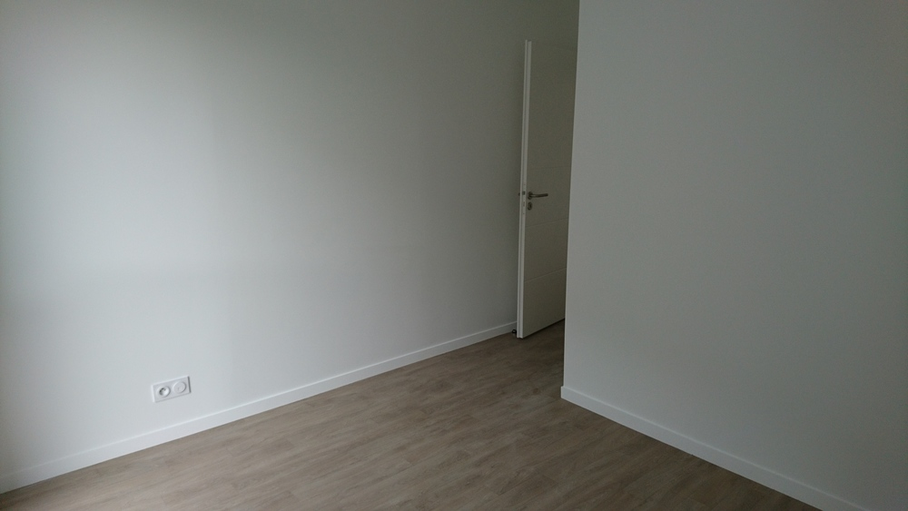
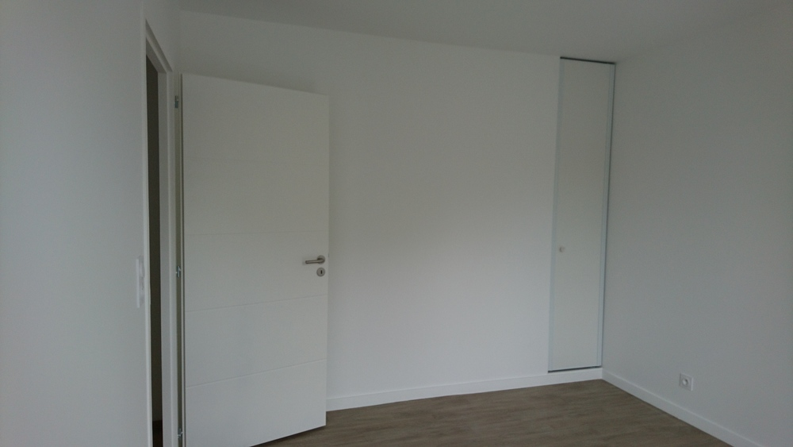
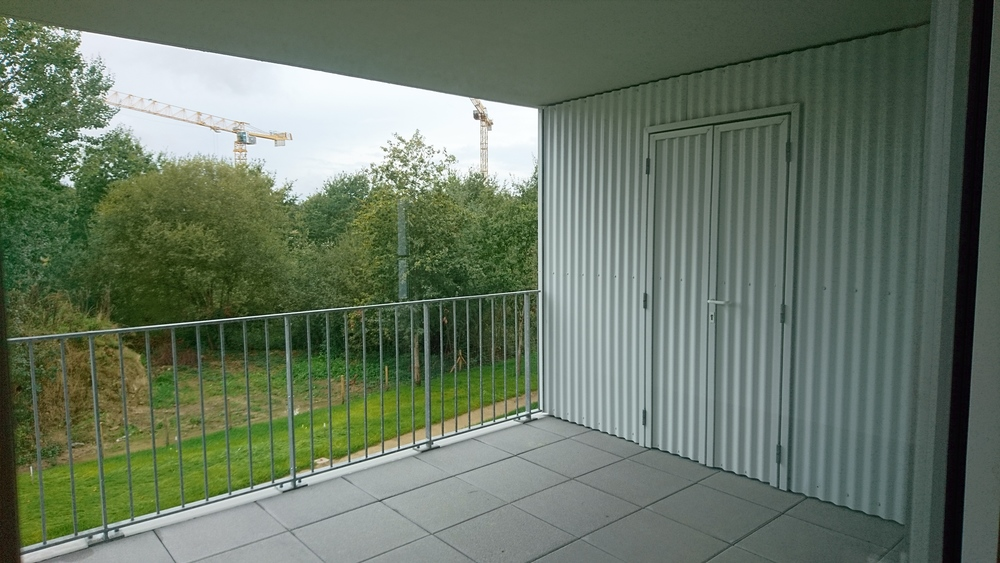
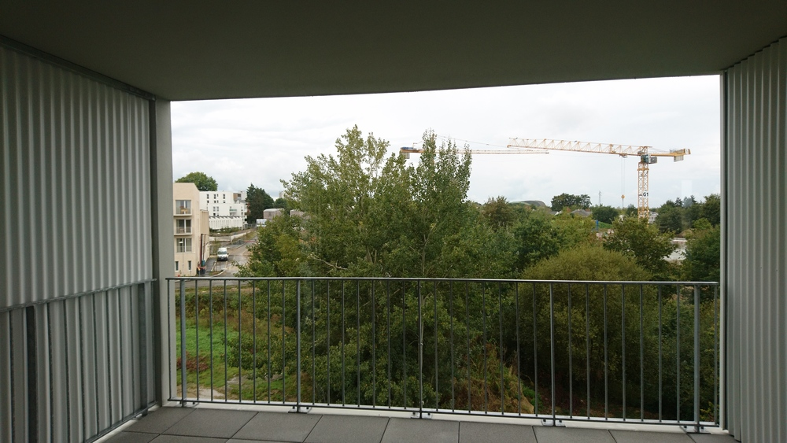
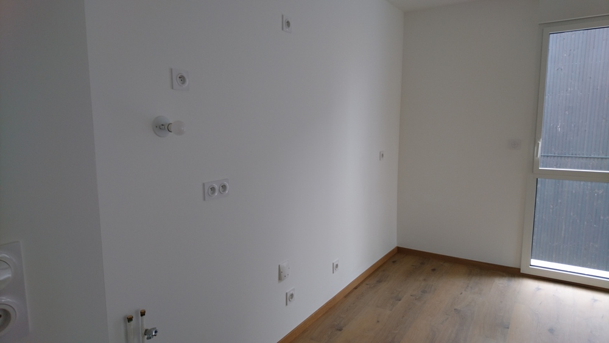
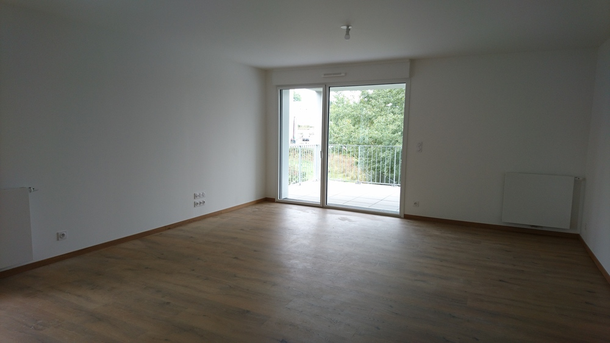
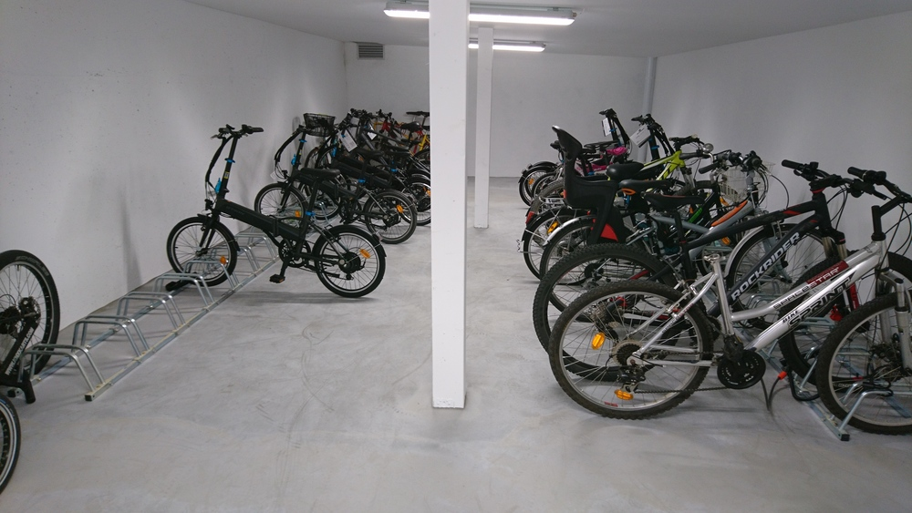

# appartement Saint Jo résidence toute neuve

[40 rue de la grange aux loups](https://www.google.fr/maps/place/40+Rue+de+la+Grange+au+Loup,+44300+Nantes/@47.2673873,-1.5209214,15z/data=!4m5!3m4!1s0x4805efc30890f0fd:0xbd633641df1fc7d0!8m2!3d47.2636088!4d-1.517735)

[annonce Le bon coin](https://www.leboncoin.fr/ventes_immobilieres/1845509886.htm)

## Impressions d'ensemble

3 mots pour qualifer cet appartement:

 - blanc
 - touches de marron
 - hyper pratique

L'immeuble a été livré mi septembre. Il reste deux appartements à vendre.

Deux T3 de 71 m2, même configuration (cf annonce le bon coin). Celui au 2ème étage coûte 275000 euros, l'autre au 4ème et dernier étage coûte 283000 euros.

3 appartements par étage.
Pas de vis à vis côté jardin (pour le moment).
Charges de copro: 900 euros/ans.

Les appartements sont livrés sans cuisine.
Chauffe-eau au gaz pour chauffer l'eau:

 - les radiateurs
 - la douche
 - la cuisine

Il est prévu une facture de gaz de 150 euros par an.
Les performances du bâtiment sont vraiment intéressantes.

L'architecture l'est moins. Blanc à l'extérieur.

De côté.

Sur la façade.

De derrière.

Dixit le commercial: comme c'est tôlé à l'extérieur, les ravalements se feront au karcher (sous entendu pas cher et rapido).

Blanc à l'intérieur et marron.

## Transport / commerces
Le C6 (station embellie) est à 2 minutes à pied, le T1 (station Halvèque) à 10 minutes. Le bus 95 est à deux minutes également.

Boulangerie, magasin bio, super U express, docteurs, pharmacie à moins de 10 minutes à pied. Paridis proche également.

## Les murs sont blancs, le sol est marron.

Stratifié marron dans le couloir d'entrée et dans le séjour.
Revêtement PVC marronasse dans les chambres et la salle de bain.

## Chambre principale
Les murs sont blancs, revêtement PVC.

Le petit "plus" mesquin. Regardez la largeur du placard.
C'est à cause des normes PMR, paraît il.
Selon le commercial, ils en font moins sur certains postes pour que les personnes aménagent selon leur capacité, leur moyens.

## Balcon
12m2, mazette.
Doté d'un cellier tôlé blanc, d'une taille qui force le respect. très très pratique, je dois dire.
Prise électrique étanche, robinet (pour le jardin :) ). pratique vous dis-je.

Le balcon du 4ème étage est doté d'un pare-vent sur le côté qui accentue le côté "je suis seul au monde sur mon balcon".
Au dernier étage on voit le stade de la Beaujoire. On doit l'entendre également.

## Salle de bains
Spacieuse et pratique, manque de rangement.

Blanche et marron
dans le ton.

# cuisine/séjour
Pas de cuisine livrée, mais un linéaire de 5m. y a de quoi faire :D.

# Parking
2 places de parking voiture dont une prévue pour accès PMR de 17m2!!
De quoi garer 3 twingos en travers. Carrément grandiose.

Le local à vélo est à la hauteur...

Les 14 premiers propriétaires se sont vus offrir un vélo électrique Décathlon.
Cela explique qu'il y en ait autant dans le garage.